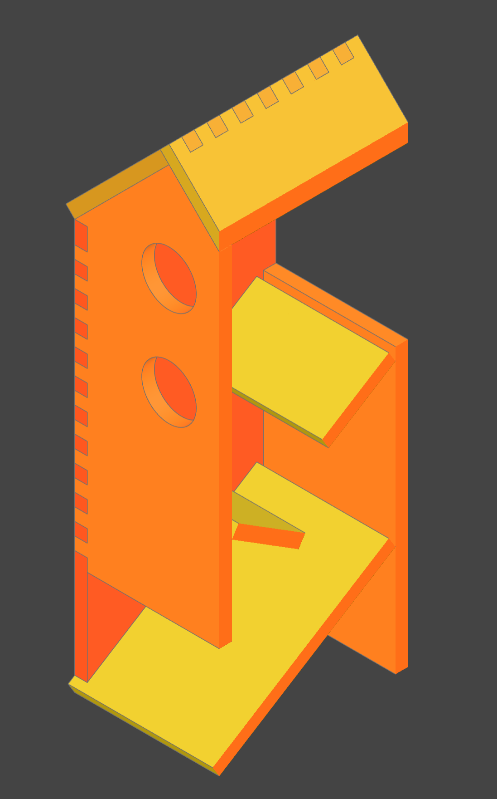

# Fluegelschlag‑Ersatzhaus

Ersatz‑Vogelhaus für das Spiel "Flügelschlag" — einfache Laser‑cut‑Bausatz‑Teile, die mit CadQuery erzeugt und als 2D‑DXF für den Laserschnitt exportiert werden.

|Vorschau|Schnitt|
|--------|-------|
|||

## Inhalt

- Python‑Skripte zur Erzeugung der Teile (CadQuery):
  - `birdhouse.py` — erzeugt Front-, Back-, Side-, Roof- und Slide‑Platten, exportiert DXF und zeigt die Teile in ocp_vscode.
  - `connectors.py` — Hilfsfunktionen zum Erzeugen von Steckverbindern/Cutouts entlang einer Kante.
  - `constants.py` — alle geometrischen Parameter und Maße.
- Ausgabe: `construction_files/*.dxf`

## Voraussetzungen

- Python 3.8+
- CadQuery (mit passender OCP/OCCT)
- ocp_vscode (für die Visualisierung in VS Code) — optional zum Anzeigen
- Ein DXF‑fähiges Zeichenprogramm / Laser‑Slicer zum Zuschneiden

Installation (Beispiel):

```bash
python -m venv .venv
.venv\Scripts\activate
pip install cadquery ocp_vscode
```

(Installation kann je nach System und CadQuery‑Build variieren.)

## Nutzung

Im Projektordner ausführen:

```bash
python birdhouse.py
```

Dadurch werden:

- DXF‑Dateien in `construction_files/` erzeugt (z. B. `front_plate.dxf`, `side_plate.dxf` …).
- Falls `ocp_vscode` verfügbar ist und in VS Code verwendet wird, werden die Teile im Viewer angezeigt.

## Anpassen

Änderungen an Maßen und Layout erfolgen in `constants.py`. Steckverbinder‑Abstand und -Größen sind in `connectors.py` definiert.

Hinweis: Maße sind typischerweise in Millimeter. Vor dem Lasern Toleranzen und Materialstärke prüfen.

## Dateiaufbau

- `birdhouse.py` — Erzeugt und exportiert die Modelle.
- `connectors.py` — Helfer: `distribute_connectors(...)`.
- `constants.py` — Parameter / Maße.
- `construction_files/` — Ausgabe DXF.

## Lizenz

Projektdateien stehen ohne Lizenzhinweis. Vor Verwendung für kommerzielle Zwecke Lizenz klären oder eine Lizenzdatei hinzufügen.

## Kontakt / Weiteres

Für Änderungen an Geometrie oder Exportparametern `constants.py` bearbeiten und `birdhouse.py` neu ausführen.
